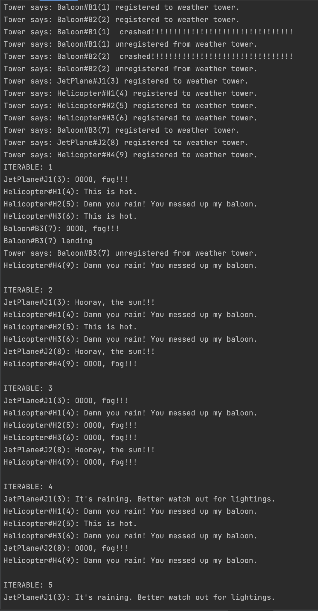

# Avaj_Launcher

Проект имитация работы аэропорта. Отслеживание перемещения летательных аппаратов и изменение их координат в зависимости
от погодных условий. 

Переходим в папку java/
Путь относительно корневой папки проекта src/main/java/

Собираем проект:

find * -name "*.java" > sources.txt

javac @sources.txt 

И запускаем его:

java main/Main.java ../resources/scenario.txt 

Пример отображения:
